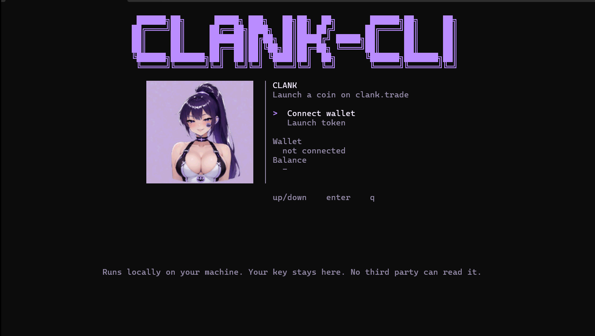

# clank-trade

Launch a coin on [clank.trade](https://clank.trade) from your terminal. The app runs on your computer, signs with your own wallet, and sends the launch to Robinhood Chain (chain ID **4663**).



## The screen

`clank-trade` opens one full-screen page.

- The title **CLANK-CLI** is drawn with block characters.
- The portrait sits on the left.
- The menu sits on the right: **Connect wallet**, **Launch token**, and **Log out** after a wallet is connected.
- The bottom line is the privacy note: your key stays on this machine.

The page shows whether a wallet is connected and the ETH balance on Robinhood Chain.

## What you need

| Item | Detail |
| --- | --- |
| Node.js | Version 20 or newer |
| npm | Installed with Node.js |
| Terminal | Windows Terminal, so the portrait renders |
| Wallet | A private key you control, `0x` plus 64 hex characters |
| Gas | At least **0.001 ETH** on Robinhood Chain |
| Logo | A PNG, JPEG, or WebP file, 2 MB or smaller |

The factory launch fee is **0 ETH**. The CLI does **not** buy any tokens when it launches. The 0.001 ETH is only so the wallet can pay network gas. ETH sitting on Ethereum mainnet does not count. The balance has to be on Robinhood Chain, chain ID 4663.

## 1. Install Node.js

1. Download the current Node.js 20 LTS installer from [https://nodejs.org](https://nodejs.org).
2. Run the installer and leave **npm** enabled.
3. Close every open terminal, then open a new one.
4. Check the install:

```powershell
node -v
npm -v
```

`node -v` should print `v20` or higher.

## 2. Install clank-trade

In that new terminal:

```powershell
npm install -g github:Clank-Bot-CLI/Clank-CLI
```

npm clones the repository, installs the library it needs, and adds the `clank-trade` command.

If Windows says the command is not recognized, close the terminal, open a new one, and try again. The global npm folder must be on your `PATH`. You can see that folder with:

```powershell
npm prefix -g
```

## 3. Open the app

```powershell
clank-trade
```

You should see the home screen in the picture above.

On the home screen:

| Key | Action |
| --- | --- |
| Up / Down | Move between Connect wallet, Launch token, and Log out |
| Enter | Open the selected item |
| q | Quit the app |

If you open **Launch token** before a wallet is connected, the screen stays on the home page and says **Connect a wallet before launching a token.**

## 4. Put ETH on the wallet

You need the wallet that matches the private key you will paste in the next step.

1. Copy that wallet address.
2. Send at least **0.001 ETH** to it **on Robinhood Chain** (chain ID 4663).
3. Wait until the transfer is confirmed.

0.001 ETH is the minimum to keep in the wallet so gas can be paid. A launch with no token buy costs less than that. Do not send only Ethereum mainnet ETH and expect this balance to change.

## 5. Connect the wallet

1. On the home screen, select **Connect wallet** and press Enter.
2. Paste your private key into **Private key**. Each character is shown as `*`.
3. Press Enter.

The screen then runs three checks:

| Command | What it checks |
| --- | --- |
| `clank key verify` | The key is a valid 32-byte hex key |
| `clank chain ping --id 4663` | The network is Robinhood Chain |
| `clank balance` | The wallet's ETH balance on that chain |

When all three pass, the screen prints **Connection successful.** Press **Esc** to return home. The menu now shows the short address, the balance, and **Log out**.

The key is kept in memory for this visit only. It is not written to disk, not printed, and not sent to a third party. Closing the app clears it. The next visit asks for the key again, unless you set `CLANK_PRIVATE_KEY` yourself in the terminal before starting.

On the private-key screen, **Esc** returns home. There is no back step.

## 6. Launch a coin

Select **Launch token** and press Enter. Fields appear one at a time, in one column. Earlier answers stay on screen.

| Step | Field | What to enter |
| --- | --- | --- |
| 1 | Coin name | The name, up to 64 bytes |
| 2 | Ticker | The symbol, up to 16 bytes. It is stored in uppercase |
| 3 | Image path | Full path to a PNG, JPEG, or WebP logo, for example `C:\Users\ACER\Downloads\logo.png` |
| 4 | Twitter | Optional link. Press Shift to skip |
| 5 | Website | Optional link. Press Shift to skip |
| 6 | ETH to buy | Fixed at **0**. The launch does not buy tokens |
| 7 | Type YES to send | Type `YES` and press Enter |

A logo is required. clank.trade rejects a launch with an empty image. The file must be 2 MB or smaller.

Keys while you are on a launch field:

| Key | Action |
| --- | --- |
| Enter | Confirm this field and show the next one |
| Shift | Skip this field |
| Ctrl+Q | Go back one field |
| Esc | Return home without launching |

After you confirm `YES`, the CLI signs in to clank.trade, uploads the image, and sends `launchToken` with **0 ETH** of token buy. You pay only the network gas. When the transaction is confirmed, the screen prints the token address and a page link:

```text
https://clank.trade/coin/0x...
```

**Esc** leaves that result and returns home.

## 7. Log out

After a wallet is connected, **Log out** appears under **Launch token**. Select it and press Enter. The address and balance clear. The key is dropped from memory.

## Launch from the command line

The same launch can be run without the screen. Add `--yes` only when you want the transaction sent. Without `--yes`, the command simulates and does not broadcast.

```powershell
$env:CLANK_PRIVATE_KEY = "0xYOUR_KEY"
clank-trade launch --name "Coin name" --symbol TICKER --image .\logo.png --twitter "https://x.com/you" --website "https://example.com" --yes
```

Other commands:

```powershell
clank-trade status
clank-trade address
clank-trade --help
```

`status` prints the factory, whether launches are enabled, the launch fee, and the graduation threshold. Graduation is the later pool threshold. It is not the amount required to create the coin.

Optional environment variable:

```powershell
$env:CLANK_RPC_URL = "https://rpc.mainnet.chain.robinhood.com"
```

That RPC is already the default.

## What stays on your machine

For this CLI, the accurate statement is this. The private key is used only to sign on the machine where the CLI is installed. It is not written to disk, and it is not sent anywhere. The coin image and the signed transaction still have to be sent to clank.trade and Robinhood Chain for the coin to be created. No third party can read the key. That does not mean no data leaves the machine.

The home screen shortens the same point to one line:

> Runs locally on your machine. Your key stays here. No third party can read it.

## If something fails

| What you see | What to do |
| --- | --- |
| `clank-trade` is not recognized | Open a new terminal after `npm install -g`. Check `npm prefix -g` is on `PATH`. |
| Connect a wallet before launching a token | Connect a wallet first, then open Launch token. |
| Logo is required | Pass a real image path. An empty logo is rejected. |
| Image file was not found | Use the full path, for example `C:\Users\ACER\Downloads\logo.png`. |
| This wallet has 0 ETH on Robinhood Chain | Send at least 0.001 ETH on chain 4663, then connect again. |
| Not enough ETH on Robinhood Chain for gas | The balance is too low for gas. Add ETH on chain 4663. |
| Connection failed | The RPC did not answer, or the key is not valid. Check the key and your network, then try again. |

## Network

| | |
| --- | --- |
| Site | https://clank.trade |
| Chain | Robinhood Chain |
| Chain ID | 4663 |
| Gas token | ETH |
| Default RPC | https://rpc.mainnet.chain.robinhood.com |
| Explorer | https://robinhoodchain.blockscout.com |
